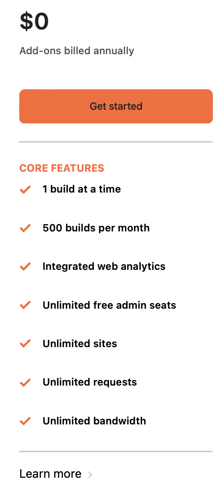
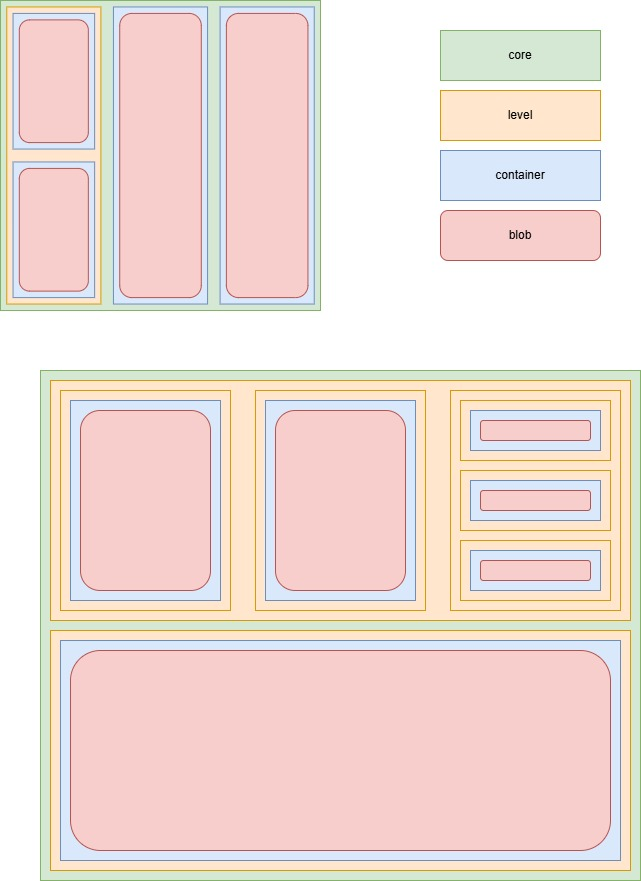
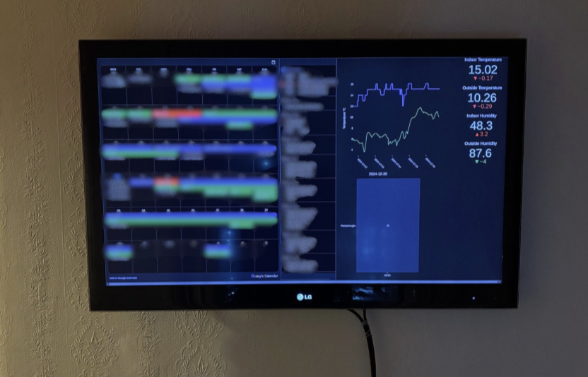

# Billdrian

Paint like [Piet Mondrian](https://en.wikipedia.org/wiki/Piet_Mondrian) and dashboard like a pro.

## Background

I created this project initially to split a web page into multiple dashboards, in order to take advantage of Chromes full screen. With Windows Chrome you can press F11 to open a web page in full screen mode, removing the top bar of the browser, giving a more clean look. My dashboard project allows you to have different dashboards in one web page, whilst also taking advantage of the full screen mode.

During development I noticed the squares I was creating looked very similar to Piet Mondrians [Tableau I](https://www.piet-mondrian.org/tableau-i.jsp). That is when I decided to also create a Mondrian generator. Using the same backend code, I added additional menu features to allow users to paint the squares.

## Tech Stack

Going into the project I had one requirement that it should all be native HTML, Javascript and CSS. I had previous used web frameworks and tools such as ReactJS and Tailwind, but never developed using native languages. I wanted to use the native stack to get benefits from performance and SEO rankings. I also did not want any client side or server side rendering as the content I was producing was mostly static and I wanted the application to be snappy when a user visited it.

I debated splitting up the projects vs having one project, however, found a lot of cross over so went with the approach of both projects using the same repository.

My experience of creating a reactive site only using the native stack was enjoyable, however, I found as the requirements increased the complexity increased. Trying to structure my code in a readable and usable manner was complicated as I wasn't sure of the best practices.

The end product does work and function as expected, however, there are some edge cases where the squares can get confused and break. The product isn't perfect but reaching 100% completion on a project is always challenging and I am happy with the state it is in.

### Deployment

I wanted to experiment with Githubs actions as I really liked the UI and how it integrated with my repository. Github Actions also has a hobbiest friendly tier where it's free! As Github is Azure owned I thought I'd deploy my static sites onto Azure Blobs. The implementation was smooth, however, as soon as I wanted to use a custom domain I had to upgrade my blob to use [Azure CDN](https://learn.microsoft.com/en-us/azure/cdn/cdn-overview). You can also use the [Custom Domains Tab](https://learn.microsoft.com/en-us/entra/fundamentals/add-custom-domain) on Azure Blobs, however, it only works with Sub Domains and your DNS record has to be a CNAME.

Instead I found Cloudlare provides a free version of their [Pages](https://pages.cloudflare.com). It comes with CI/CD, builds and unlimited pages with unlimited requests and bandwidth (when writing this)! They also distribute your static content around the globe for faster access (just like the paid for Azure CDN). 

[source](https://www.cloudflare.com/en-gb/plans/developer-platform/)

I chose to not use the default git connection Cloudflare provides and keep my Github Actions and use [Wrangler](https://www.npmjs.com/package/wrangler) on my Git Action workflow to deploy onto Pages.

## Data Structure

When you click paint or generate on either of the static apps, they convert the square design to a JSON object.

To view your JSON data, open the developer console (press F7 or inspect element and change the tab to console), then run the code below.

    JSON.stringify(getData())

The code is executed at [app.js](scripts/app.js#L154). You can see the JSON is encoded to Base64. The encoded data is then parsed to the paint page, where it is rendered. I went with the data in the URL to allow people to copy and paste their pages and send it anywhere.

To try understand the structure I created a visual aid above.

## Example

Using the dashboard generator I was able to create a dashboard for my flat, where we have two Google calendar links, then a custom dashboard with metrics of our flat. That was also created using a static website and Plotlys Javascript library.